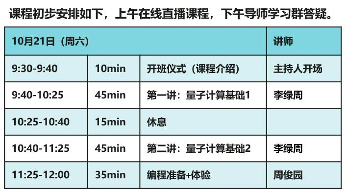
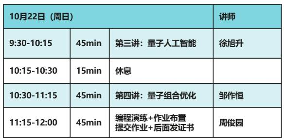

恭喜大家通过审核，加入昇思MindSpore Quantum SIG主办的量子软件编程速成班。
课程时间：2023年10月21-22日 周末两天

中山大学和华为量子专家与你面对面，解密最新最硬核的技术，请务必在课程开始前，完成如下PDF文档的操作指导。
[MindSpore Quantum编程实践指导 - jupyterlab](MindSpore%20Quantum编程实践指导%20-%20jupyterlab.pdf)
请大家准备好电脑，点击链接https://m.koushare.com/lives/room/658980提前设置好开播提醒，精彩不容错过！完成课程和作业将会获得开发者专属证书和礼物🎁
希望大家能在本次课程中有所收获，了解最前沿的动态和技术，为自己未来的学业和工作打基础！
